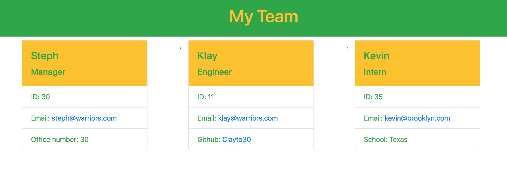

# team-profile-generator

## Description 

In order to demonstrate that I have developed skills using object oriented programming and test driven development,
I set out to satisfy the requirements of my assignment while providing professionals a great way to organize
information about their staff.

Anybody who needs to keep track of some employees and information associated with them quickly and in an organized
way can use my app to create a webpage that will organize their inputs into a nice, neat html display.

While this is not deployed, you can find my [GitHub repo for this project​](https://github.com/Clayto30/team-profile-generator).

I suggest you see my project in action by taking a look at [my Walkthrough video](https://drive.google.com/file/d/15W1ofi7xwr2G20MvFjoa8ajYBsMtnkRm/view).

If you are looking for a sample index.html, please look at my repository in the dist/ directory. The mockup.html is not a sample of html written 
dynamically. Rather it is a file that I hard-coded. The other file index.html, is a sample of a dynamically created file! Check it out!
Also note, that if you clone the repo and run the app, your index.html will overwrite this index.html. I hope this info helps! :)

## Table of Contents (Optional)

* [Installation](#installation)
* [Usage](#usage)
* [Credits](#credits)
* [License](#license)

## Installation

My application requires that you have node packages. This will require you to have inquirer and the jest testing
package installed and running properly. Then, when you have cloned my repo and initiated those node packages, we 
can really get started!

## Usage 

When you have cloned the repo, change directories to get into the root folder and start using the Command
Line Interface! Type in "node index" and the rubber hits the road. Get ready to input some data on your employees!

First, you input some data on the team manager. Following that, you can add as many interns and engineers as you like!
When your team is all accounted for, click on "finish building my team."

After that, take a look at the dist/ folder and your index.html should appear! I hope you are as happy to see
it there as I was! Go ahead and open that up and open it in browser. You should see something like this:

## Credits

I am enrolled in a coding bootcamp at the UC Berkeley Extension. This project was designed by them, and I am 
able to attempt to fulfill its requirements thanks to that instruction.

My team of instructors are exceptional, and none of this would be possible without them. I have to mention
Mason, Wes, and John specifically. They are invaluable resources.

## License

MIT License

Copyright (c) 2021 Clayton Goff

Permission is hereby granted, free of charge, to any person obtaining a copy
of this software and associated documentation files (the "Software"), to deal
in the Software without restriction, including without limitation the rights
to use, copy, modify, merge, publish, distribute, sublicense, and/or sell
copies of the Software, and to permit persons to whom the Software is
furnished to do so, subject to the following conditions:

The above copyright notice and this permission notice shall be included in all
copies or substantial portions of the Software.

THE SOFTWARE IS PROVIDED "AS IS", WITHOUT WARRANTY OF ANY KIND, EXPRESS OR
IMPLIED, INCLUDING BUT NOT LIMITED TO THE WARRANTIES OF MERCHANTABILITY,
FITNESS FOR A PARTICULAR PURPOSE AND NONINFRINGEMENT. IN NO EVENT SHALL THE
AUTHORS OR COPYRIGHT HOLDERS BE LIABLE FOR ANY CLAIM, DAMAGES OR OTHER
LIABILITY, WHETHER IN AN ACTION OF CONTRACT, TORT OR OTHERWISE, ARISING FROM,
OUT OF OR IN CONNECTION WITH THE SOFTWARE OR THE USE OR OTHER DEALINGS IN THE
SOFTWARE.

---
